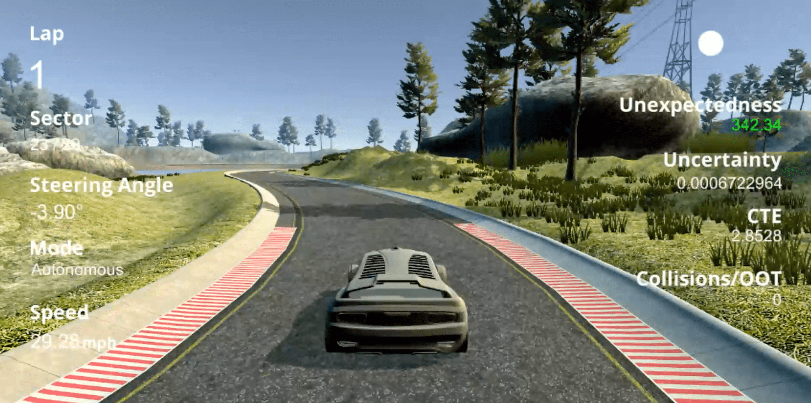

# JSEP 2021 Replication Package

This repository contains the artifacts attached to the paper "_Confidence-driven Weighted Retraining for Predicting Safety-Critical Failures in Autonomous Driving Systems_" by Andrea Stocco (USI) and Paolo Tonella (USI).

## Simulation platform

You need to clone [this version of the Udacity simulator  for self-driving cars](https://github.com/tsigalko18/udacity-self-driving-car/tree/mc-dropout). 


## Dependencies

**Software setup:** We adopted the PyCharm Professional 2020.3, a Python IDE by JetBrains.

First, you need [anaconda](https://www.continuum.io/downloads) or [miniconda](https://conda.io/miniconda.html) installed on your machine. Then, you can create and install all dependencies on a dedicated virtual environment, by running one of the following commands, depending on your platform.

```python
# macOS
conda env create -f environments.yml 

# Windows
conda env create -f windows.yml
```

Alternatively, you can manually install the required libraries (see the contents of the *.yml files) using ```pip```.

**Hardware setup:** Training the DNN models (self-driving cars and autoencoders) on our datasets is computationally expensive. Therefore, we recommend using a machine with a GPU. In our setting, we ran our experiments on a machine equipped with a AMD Ryzen 5 processor, 8 GB of memory, and an NVIDIA GPU GeForce RTX 2060 with 6 GB of dedicated memory.

## Training

### Train the autoencoders

* Copy the config ``config.py.sample`` into a custom config file, e.g., ``config_my.py``
* Place the training set under the datasets folder. Set up the parameters under the section `project settings`
* Configure the parameters under the section `autoencoder-based self-assessment oracle settings`
* Run the file `selforacle/vae_train.py`

### Train the self-driving car models

* Copy the config ``config.py.sample`` into a custom config file, e.g., ``config_my.py``
* Place the training set under the datasets folder. Set up the parameters under the section `project settings`
* Configure the parameters under the section `self-driving car model settings`
* Run the file `self_driving_car_train.py`

## Usage

* Copy the autoencoder within the `sao` folder. Set up the parameters, including the self-driving car model to use, under the section `Udacity simulation settings`
* Start up [the Udacity self-driving simulator](https://github.com/tsigalko18/udacity-self-driving-car/tree/mc-dropout), choose a scene, and press the Autonomous Mode button. Then, run the file `self_driving_car_drive.py`

## Replicate JSEP 2021 experiments

### Datasets

Datasets for the experiment have a combined size of 35 GB. They are available upon request. For specific settings, it is more convenient to train your own models using our scripts (you do not need the simulator):

* Run the file `scripts/vae_train_all.py`
* Run the file `scripts/vae_evaluate_class_imbalance_all.py`
* Run the file `scripts/vae_evaluate_novelty_detection_all.py`

## Improved Udacity simulator

### Video of the simulator
*Note:* Click on the screenshot image to watch a demo video.

<a href="https://youtu.be/m2UoiBoA2-w"></img></a>

## License 
MIT. See the [LICENSE.md](https://github.com/testingautomated-usi/jsep2021-replication-package-material/blob/main/LICENSE) file.

## Contacts

For any questions, feel free to contact Andrea Stocco ([andrea.stocco@usi.ch](mailto:andrea.stocco@usi.ch)).